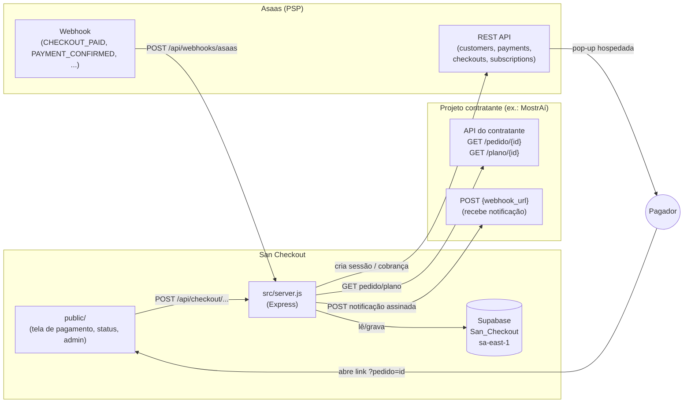

# Arquitetura — San Checkout

## Stack

- **Runtime**: Node.js ≥22 (`.nvmrc`, `package.json` "engines"), ESM (`"type": "module"`).
- **Framework**: Express 4.
- **Banco**: Supabase (Postgres 17 gerenciado), acessado via
  `@supabase/supabase-js` — sem ORM, queries via cliente Supabase
  (`select`/`insert`/`update`/`rpc`), RLS habilitada em toda tabela.
- **Front-end**: HTML/CSS/JS puro em `public/` — **sem framework, sem
  bundler, sem passo de build**. Módulos ES nativos (`<script type="module">`).
- **Segurança de transporte/HTTP**: `helmet`, `cors`, `express-rate-limit`.
- **PSP**: Asaas, via REST (`src/services/asaasService.js`,
  `src/config/asaas.js`).
- **Testes**: suíte própria sem framework (`node:assert` +
  `tests/executar.js` como runner), Playwright + axe-core só para as
  duas verificações que exigem navegador real (`scripts/acessibilidade.mjs`,
  `scripts/desempenho.mjs`) — fora do `npm test`, o CI não tem Chromium.
- **Deploy backend**: Northflank (build Docker a partir da `main`, deploy
  automático). **Deploy front**: Cloudflare Pages (deploy automático via
  GitHub App, direto de `public/`, sem build).

## Diagrama — visão de sistema



## Mapa de diretórios (o que cada um faz)

```
src/
  server.js              # monta o Express: middlewares, rotas, tratamento de erro global
  config/
    asaas.js              # ÚNICO lugar que sabe URL/ambiente da Asaas (sandbox vs produção)
    supabase.js            # cliente Supabase (service_role key)
  routes/                 # um arquivo por área — só liga método+caminho ao controller
  controllers/             # validação de entrada, orquestração, resposta HTTP
  services/                # regra de negócio e integração externa, sem conhecer HTTP
  middlewares/
    limitadores.js          # rate limiting por rota (fábrica, uma instância por rota)
  utils/                    # funções puras reaproveitadas (validação, segurança, formato)

public/
  index.html, status.html, admin.html   # as três telas
  js/modules/               # um handler por método de pagamento/fluxo
  js/utils/                  # validação de formulário, máscara, chamada de API
  css/                       # design tokens (theme-engine.css) + componentes

tests/                      # cada arquivo é uma suíte independente, reunida por tests/executar.js
scripts/                    # operação: acessibilidade, desempenho, expurgo, backup, ensaio de restauração
supabase/migrations/        # schema, numerado e imutável (nunca editar uma já aplicada)
docs/                       # specs, erros catalogados, funcional, pendências
```

## Controllers e o que cada um resolve

| Controller | Rota base | Responsabilidade |
|---|---|---|
| `pedidoController.js` | `/api/checkout/*` (pedido) | Resolve pedido avulso via API do contratante |
| `planoController.js` | `/api/checkout/*` (plano) | Resolve plano de assinatura via API do contratante |
| `asaasCheckoutController.js` | `/api/checkout/{pix,boleto,cartao,assinatura,...}` | Cria a cobrança/sessão na Asaas para cada método |
| `checkoutController.js` | `/api/checkout/asaas-checkout/status/:id` | Polling de status da pop-up Asaas Checkout |
| `webhookController.js` | `/api/webhooks/asaas` | Recebe e processa notificação assinada da Asaas |
| `cobrancaConsultaController.js` | `/api/checkout/cobranca/*`, `/consultar-assinatura` | Conciliação: reconfere contra a Asaas ao vivo |
| `assinaturaController.js` | `/api/checkout/{cancelar,pausar,retomar}-assinatura` | Ciclo de vida da assinatura, iniciado pelo contratante |
| `trocaPlanoController.js` | `/api/checkout/trocar-plano` | Upgrade/downgrade com acerto proporcional |
| `refundController.js` | `/api/checkout/estornar` | Estorno, só pelo contratante |
| `adminController.js` | `/api/admin/*` | CRUD de contratantes, métrica, painel — atrás de auth própria + Cloudflare Access |

## Services (regra de negócio, sem HTTP)

| Service | Papel |
|---|---|
| `asaasService.js` | Toda chamada REST à Asaas — cobrança, checkout, assinatura, estorno |
| `pedidoService.js` | Resolve pedido/plano (chamada `GET` ao contratante, com teto de tempo) |
| `assinaturaService.js` | Estado da assinatura no nosso banco (buscar, reivindicar troca, aplicar troca) |
| `cobrancaService.js` | Leitura/escrita da tabela `cobrancas`, filtro por método de assinatura |
| `proporcionalService.js` | Função pura: cálculo do acerto de troca de plano (as sete regras do dono) |
| `taxaService.js` | Conversão das taxas próprias do Checkout |
| `erroService.js` | Captura de exceção (Lei 8) — agrega por impressão digital |
| `auditoriaWebhookService.js` | Log de auditoria do webhook, sem payload de pessoa |
| `metricaService.js` | Métrica de sucesso (cobranças confirmadas), filtra `ambiente`/`e_teste` |
| `expurgoService.js` | Expurgo de dado pessoal (Lei 10) — lista branca do que fica após anonimizar |

## Fluxo de dados — pagamento avulso (Pix/boleto/cartão)

1. Contratante manda o comprador para `checkout.sancocore.com.br?contratanteId=X&pedidoId=Y`.
2. `public/js/app.js` chama `GET /api/checkout/pedido/:contratanteId/:pedidoId` (`pedidoController`).
3. `pedidoService.resolverPedido` chama a API do contratante (`GET {api_base_url}/pedido/{id}`),
   valida `X-Checkout-Key`, aplica teto de tempo (`alvoDeRede.js` valida o destino contra SSRF).
4. Front renderiza total, itens, formulário do método escolhido.
5. `POST /api/checkout/{pix,boleto,cartao}/...` (`asaasCheckoutController`) cria a cobrança na
   Asaas (`asaasService`) e grava linha em `cobrancas` (`pendente`).
6. Pagador paga (Pix/boleto direto, ou pop-up para cartão).
7. Asaas manda `POST /api/webhooks/asaas` (`webhookController`) — assinatura HMAC verificada
   (`assinaturaWebhook.js`), idempotência por `charge_id`+`status`, atualiza `cobrancas`,
   notifica o contratante (`webhook_url` dele) de forma assíncrona (fire-and-forget com teto).
8. Front faz polling em `GET /api/checkout/asaas-checkout/status/:id` (cartão) ou recarrega a
   página de status pelo link permanente (`status.html`).

## Fluxo de dados — assinatura e troca de plano

Documentado em detalhe (11 etapas + variante Pix Automático) em
`docs/ciclo-assinatura-mapa.md` (raiz) — não duplicado aqui. Resumo:
criação grava `ciclo` no momento da criação (nunca via webhook, que não
traz esse dado de forma confiável); vínculo `assinatura ↔ cobrança`
feito por `PAYMENT_CONFIRMED.payment.checkoutSession`, nunca por
`CHECKOUT_PAID`; troca de plano cobra o acerto **antes** de alterar
(fail-closed) e **relê** a Asaas depois do `PUT` porque ela responde
`200` e ignora em silêncio campo que não conhece.

## Dependências críticas

- **Asaas fora do ar** → nenhuma cobrança nova, mas pagamentos em
  andamento não se perdem (idempotência); webhooks pendentes chegam
  quando ela voltar.
- **Supabase fora do ar** → `/api/saude` responde 503, sistema inteiro
  para (não há cache/fallback local).
- **API do contratante fora do ar ou lenta** → só afeta pedidos/planos
  daquele contratante (teto de tempo isola — `nenhuma-chamada-de-saida-sem-teto.js`).
- **Northflank fora do ar** → backend inteiro fora, front (Cloudflare
  Pages) continua servindo HTML mas toda chamada `/api/*` falha.

## O que NÃO existe (não presumir)

- Sem fila de mensageria (RabbitMQ, SQS, etc.) — a única "fila" é a de
  reenvio de webhook da própria Asaas (em memória, do lado dela).
- Sem cache (Redis/Memcached) na aplicação.
- Sem ORM/migration framework de aplicação — migrations são SQL puro,
  numeradas, aplicadas via Supabase (CLI ou painel).
- Sem build step para o front — o que está em `public/` é o que é
  servido, byte a byte.
- Sem CDN própria além da que o Cloudflare Pages já dá de graça ao
  domínio.

## Observabilidade

Sem APM/tracing externo. O que existe: tabela `erros` (captura de
exceção agregada por impressão digital, Lei 8), tabela
`webhook_eventos`/`webhook_rejeicoes` (auditoria de webhook), logs de
`console.error`/`console.log` capturados pelo painel da Northflank, e
`/api/saude` como health check único. `RISKS.md` registra a ausência de
alerta ativo além do e-mail de falha da própria Asaas.
