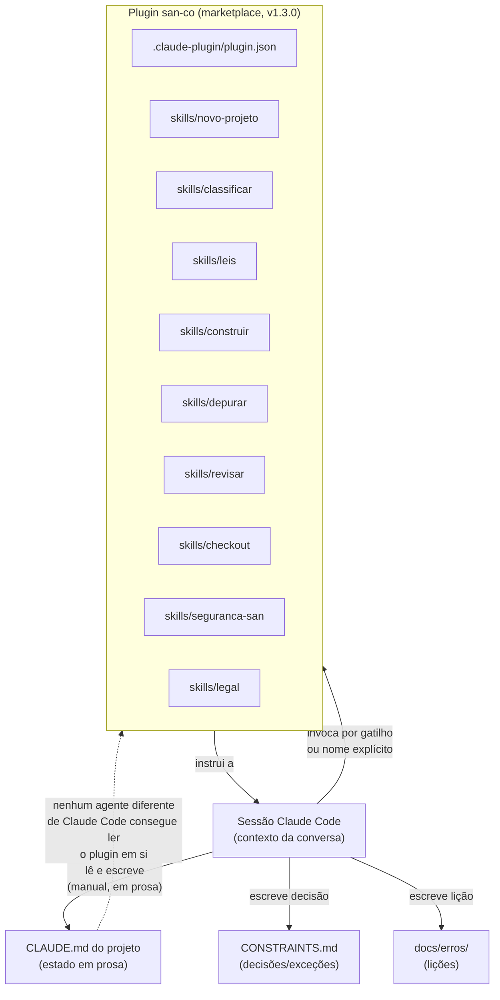

# O plugin controlador — `san-co`

Este documento audita o sistema que hoje controla o andamento deste
projeto: o plugin Claude Code `san-co` (`sancompany/Plugin_san-co`,
v1.3.0, instalado via marketplace em `.claude/settings.json`). Não
reescreve nada — mapeia o que existe, o que funciona, onde falha, e
como ele deveria evoluir para coordenar Claude, Codex e Jules juntos.

## Papel atual (o que ele deveria fazer)

Segundo o próprio README do plugin: ser "o único plugin de processo
ativo" do ecossistema San & Co. — cobrir da ideia ao lançamento e do
lançamento à versão seguinte. Na prática, isso quer dizer três coisas:

1. **Metodologia**: uma esteira de sete estações (escopo → fronteiras →
   fundação → contratos → construção → prontidão → lançamento) e onze
   leis numeradas que definem o que "correto" significa em cada estação.
2. **Checklist executável**: cada skill traz o que verificar, em que
   ordem, com exemplos e lições de erros já cometidos.
3. **Memória de processo**: instrui a sessão a registrar decisão,
   exceção e erro nos lugares certos do repositório do projeto
   (`CONSTRAINTS.md`, `docs/erros/`, `CLAUDE.md`).

## Funcionamento atual (como realmente funciona)

**É um pacote de instruções em texto, não um sistema com estado
próprio.** Fisicamente: `.claude-plugin/plugin.json` (manifesto) +
9 diretórios `skills/<nome>/SKILL.md` (+ `references/*.md` para
conteúdo longo, carregado só quando a skill é usada). Não há banco,
não há servidor, não há processo rodando — é conteúdo carregado no
contexto de uma sessão Claude Code quando uma `Skill` é invocada
(por gatilho de linguagem ou chamada explícita).

**Quem invoca cada skill é a própria sessão do agente**, ao reconhecer
que a tarefa em curso casa com a descrição da skill. Não existe
orquestrador externo decidindo isso — é auto-aplicado, sob a instrução
(em `CLAUDE.md` do projeto) de que rodar a skill certa "não é sugestão".

**Armazenamento de estado**: não há nenhum. O "estado do projeto" —
qual estação está aberta, o que já fechou, o histórico de decisões —
vive inteiramente em **prosa dentro do `CLAUDE.md` do repositório do
projeto** (58 KB neste projeto), escrita e reescrita manualmente pelo
agente a cada sessão. O plugin não lê nem escreve esse estado
diretamente; ele só instrui, em texto, que a sessão deve mantê-lo.

**Determinação de tarefa**: também não há mecanismo — a skill `leis`
define os critérios de "estação fechada" (evidência + reverificação),
mas quem decide se uma tarefa concreta atende esses critérios é o
julgamento do agente na sessão, lendo o `CLAUDE.md` e comparando.

**Comunicação entre agentes**: **não existe.** O plugin foi desenhado
para uma única superfície por vez, com uma pessoa (o dono) como
integrador entre sessões. A instrução "trocar de superfície só em
fronteira de estação" (skill `leis`) já reconhece o problema — mas a
solução proposta é disciplina do dono, não um mecanismo técnico.

**Comandos**: nenhum comando programático — as "skills" são texto que
molda o comportamento do agente, não funções chamáveis com
input/output estruturado.

**Automações**: nenhuma automação própria. O que existe de automação
real neste projeto (CI, deploy) é do repositório (`.github/workflows/`),
não do plugin.

**Integrações**: nenhuma integração técnica direta com GitHub, Supabase,
Cloudflare ou Northflank — as referências (`classificar/references/plataformas-san-co.md`,
`leis/references/automacao-plataformas.md`) são **texto descrevendo como
o agente deve operar essas plataformas**, não código que as chame.

## Arquitetura — componentes e fluxo

O ponto central do diagrama: **a seta de volta do plugin para o estado
do projeto não existe tecnicamente** — é inteiramente mediada pela
disciplina da sessão em escrever prosa correta no `CLAUDE.md`.

## Estado — o que funciona

- O **conteúdo das skills é bom**: específico, com exemplos reais,
  citando lições de erros concretos (`depurar/references/licoes-aprendidas.md`
  tem dezenas de casos numerados). Não é genérico.
- A **disciplina de registrar decisão e erro** (`CONSTRAINTS.md`,
  `docs/erros/`) funcionou neste projeto — há um histórico real e
  auditável de bugs achados e corrigidos, com data e evidência.
  `tests/o-que-os-documentos-afirmam.js` chega a travar automaticamente
  alguns números citados em prosa contra a realidade (contagem de
  suítes, links quebrados).
- A **separação estrutura vs. projeto** (skill `classificar`) e a
  política de isolamento de banco são regras claras e aplicadas de
  verdade neste projeto (Supabase próprio, nunca banco compartilhado).
- **Versionamento semântico do próprio plugin** está definido
  (`plugin.json`), com regra de quando sobe qual número.

## Problemas encontrados (concretos, não hipotéticos)

1. **O plugin é Claude-Code-only por construção.** `.claude-plugin/`,
   `SKILL.md` com frontmatter YAML, carregamento por `/plugin` e pelo
   `Skill` tool — nenhum desses mecanismos existe em Codex ou Jules.
   **Isso significa que, hoje, Codex e Jules não têm NENHUM acesso à
   metodologia do plugin**, exceto lendo o `CLAUDE.md` do projeto como
   texto (que cita a metodologia em prosa, sem repetir o conteúdo
   integral das skills). É o problema central que motivou esta tarefa.
2. **Estado do projeto é prosa manual, não dado estruturado.** O
   `CLAUDE.md` deste projeto já documenta, com data e evidência
   (`docs/erros/2026-09-18-...md`), **três casos reais** em que essa
   prosa ficou contraditória consigo mesma: uma seção dizia "Estação 6
   não iniciada" três dias depois de ela ter sido aberta; a linha do
   SHA em produção era reescrita a cada commit que a atualizava,
   tornando-se falsa no instante em que nascia (porque o commit que
   atualiza a linha muda o próprio SHA que ela afirma); uma contagem de
   suítes/rotas ficou desatualizada três vezes na mesma semana. Nenhum
   mecanismo do plugin detecta isso sozinho — só testes específicos que
   o próprio projeto escreveu por conta própria depois de ser
   queimado.
3. **Nenhuma forma de saber "qual agente fez o quê, quando" entre
   superfícies.** A instrução de "trocar de superfície só em fronteira
   de estação" é boa prática documentada, mas não há trava — dois
   agentes em superfícies diferentes podem, hoje, editar o mesmo
   `CLAUDE.md` ao mesmo tempo sem nenhum aviso além de um conflito de
   merge Git comum.
4. **Descoberta de skill depende de o agente reconhecer o gatilho.**
   Não há um índice consultável programaticamente ("dada esta tarefa,
   qual skill roda") fora da tabela em prosa no `CLAUDE.md` do projeto
   — que, pela própria regra do plugin, é "paráfrase, não fonte" e pode
   envelhecer.
5. **Nenhum mecanismo de handoff estruturado.** Não existe (antes desta
   tarefa) um arquivo único, formato fixo, que um agente escreva ao
   parar e o próximo leia para retomar sem re-perguntar tudo — cada
   sessão reconstituía isso lendo o `CLAUDE.md` inteiro (58 KB) mais o
   histórico de commits.
6. **Nenhuma verificação automática de que a metodologia foi seguida.**
   "Rodar a skill `revisar` antes de mesclar" é uma instrução textual;
   nada no CI verifica que ela rodou.

## Limitações (estruturais, não bugs)

- Um plugin de puro-texto não pode, por natureza, chamar API nenhuma —
  qualquer automação real (verificar deploy, aplicar migration) sempre
  vai depender de o agente hospedeiro ter a ferramenta (CLI/MCP), o
  plugin só pode **instruir** que ela seja usada.
- A convenção "um escritor só edita o plugin" (a sessão de manutenção)
  é organizacional, não técnica — nada impede uma sessão de projeto de
  editar a pasta do plugin por engano além de a instrução dizer para
  não fazer isso.

## Débitos técnicos

- Nenhuma referência cruzada legível por máquina entre skills — a
  navegação ("ver skill X") é só prosa com nome, sem link/id estável
  fora do nome do arquivo.
- `references/` cresce sem um limite declarado de tamanho — algumas já
  são grandes (`leis/references/*.md`, múltiplos arquivos).
- A tabela de "9 skills" no `CLAUDE.md` do projeto é uma cópia que
  precisa ser conferida manualmente contra o plugin real a cada versão
  (o próprio `CLAUDE.md` já avisa disso, "índice, não regra").

## Melhorias propostas (não implementadas nesta tarefa)

1. Um formato de **estado estruturado** (JSON/YAML curto, não prosa)
   para "estação atual", separado da narrativa histórica — a narrativa
   fica ótima como está, o que falta é um campo de estado que não possa
   contradizer a si mesmo por construção (ex.: um único arquivo/linha
   que é a fonte, tudo o mais deriva ou aponta para ele).
2. Um **índice de skills consultável fora de prosa** (ex.: um manifesto
   `skills.json` com `{nome, gatilhos, descrição}` que qualquer agente,
   com ou sem o plugin carregado, possa ler como dado).
3. **Handoff como contrato**, não como convenção — é o que
   `.ia/HANDOFF.md` começa a resolver nesta tarefa, mas vale ser
   formalizado como parte do próprio plugin (um template que a skill
   `leis` exige preencher ao fechar/pausar uma estação).
4. **Ponte explícita para agentes não-Claude** — decidir, de propósito,
   o que da metodologia deve existir também como arquivo comum
   (`.ia/`, `AGENTS.md`) versus o que continua exclusivo de skill.

## Target architecture — para coordenar Claude, Codex e Jules

O plugin, hoje, é **metodologia para uma pessoa por vez, numa
ferramenta**. Para coordenar três agentes em superfícies diferentes,
ele precisaria (sem implementar agora — é matéria de tarefa futura):

- **Uma camada de estado que vive no repositório como dado**, não só
  como prosa — é o papel que `.ia/PROJECT_STATE.md` e `.ia/HANDOFF.md`
  começam a cobrir agora, fora do plugin. Uma versão futura do plugin
  poderia formalizar o *formato* desses arquivos como parte da skill
  `leis`, mantendo-os como fonte para qualquer agente, com ou sem o
  plugin carregado.
- **Um mecanismo de handoff que o plugin exige e valida**, não só
  documenta — ex.: a skill `leis` recusando "fechar estação" sem um
  `HANDOFF.md` atualizado.
- **Task tracking que sobrevive à sessão** — hoje `docs/pendencias.md`
  cumpre parte disso em prosa; um formato mais estruturado (linha por
  item, com dependências e critério de conclusão, como este `.ia/TODO.md`
  tenta) ajudaria os três agentes a não pisarem no mesmo item.
- **Health/status como comando, não como leitura de documento** — já
  existe `/api/saude` no nível da aplicação; falta um equivalente no
  nível do *processo de desenvolvimento* (estação aberta, CI verde,
  PR pendente) que qualquer agente possa consultar sem reconstituir o
  estado lendo tudo.
- **Integração com GitHub/Supabase/Cloudflare/Northflank descrita como
  contrato, não só como prosa de runbook** — este `.ia/` já é um passo
  nessa direção; formalizar como parte do próprio plugin uniria as duas
  fontes.

## Roadmap (fases, não implementadas)

1. **Fase 1 — Formalizar o handoff.** Adotar `.ia/HANDOFF.md` (já
   criado nesta tarefa) como obrigatório ao fechar qualquer sessão de
   trabalho relevante, independente de agente.
2. **Fase 2 — Estado estruturado.** Separar "estado atual" (dado) de
   "histórico narrado" (prosa) — hoje misturados em `CLAUDE.md`.
3. **Fase 3 — Índice de skills como dado.** Permitir que um agente sem
   o plugin (Codex, Jules) saiba **que** metodologia existe e **onde**
   ler o equivalente em texto plano, sem precisar que uma pessoa
   traduza manualmente.
4. **Fase 4 — Task tracking compartilhado com critério de conclusão
   verificável.** Ligar `TODO.md`/`docs/pendencias.md` a um formato que
   os três agentes leiam e escrevam sem conflito.
5. **Fase 5 — Verificação automática de conformidade.** CI (ou um script)
   que confira, por exemplo, que todo commit no caminho do dinheiro tem
   teste associado, sem depender só da disciplina do agente.

Esta é matéria para uma tarefa futura explícita ("transformar este
plugin no sistema central de coordenação entre Claude Code, Codex e
Jules") — não implementada aqui, propositalmente.
